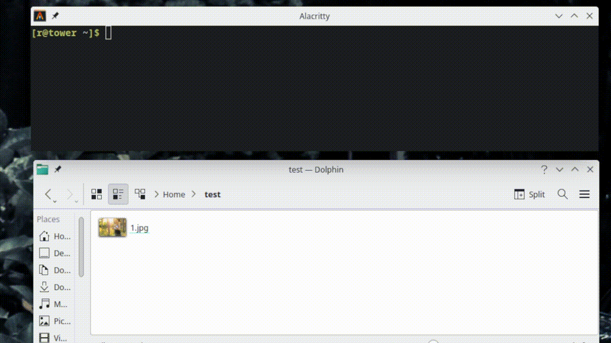

# Image Optim Docker Container



This Docker container is designed to optimize images, reducing their file size while maintaining quality. It supports resizing, format conversion and webp and avif encoding.

## Usage

To use this Docker container, you will need to have Docker installed on your machine.

The basic command for running the container is:

```terminal
sudo docker run -v [input_directory]:/app/input -v [output_directory]:/app/output -e SIZES="[sizes_list]" -e FORMATS="[formats_list]" ghcr.io/ohbob/image-optim:latest
```

`input_directory`: The directory on your local machine where the input images are located.
`output_directory`: The directory on your local machine where the optimized images will be saved.
`sizes_list`: A list of image sizes to be generated. The format should be "name, width, name, width,...".
`formats_list`: A list of formats to convert the images to. The supported formats are "webp", "avif", "jpg", "png".

For example, to optimize images located in ~/test directory, and save the optimized images in ~/test as well, generating thumb size with width of 50px, small size with width of 200px, medium size with width of 400px, large size with width of 720px, xl size with width of 920px, xxl size with width of 1920px and converting them to webp and avif the command would be:

```terminal
sudo docker run -v ~/test:/app/input -v ~/test:/app/output -e SIZES="thumb, 50, small, 200, medium, 400, large, 720, xl, 920, xxl, 1920" -e FORMATS="webp, avif" ghcr.io/ohbob/image-optim:latest
```

## Support

If you have any issues or questions, please open an issue on the GitHub repository or contact the maintainer directly.

## Acknowledgments

This container is based on the work of various open-source projects. Special thanks to the developers who have made this possible.
